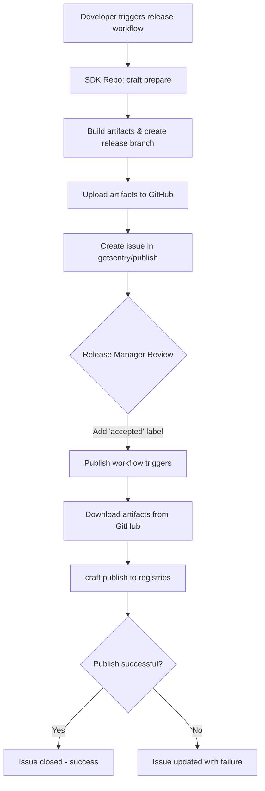

# Sentry Publish 🏠

This is a meta/control repository that implements the [Central Publish Repository](docs/rfc.md) RFC

## Quick Start

[craft quick start](https://develop.sentry.dev/sdk/craft-quick-start/)

## Release Flow



## Goals

1.  We do not want employees to publish through their own accounts
1.  We do not want employees to have access to the global credentials
1.  We do not want employees to build and publish releases from their machines
1.  We want releases to require formal approvals from a limited set of release managers
1.  We want all the above to not discourage from any engineer initiating a release

## Usage

1. Go to your repo and trigger the workflow (example: https://github.com/getsentry/sentry/actions/manual?workflow=.github%2Fworkflows%2Frelease.yml)
1. Once the workflow finishes, see the publishing request in this repo (example: #40)
1. Add the [**`accepted`**](https://github.com/getsentry/publish/labels/accepted) label to initiate publishing. Since this action requires elevated permissions, you may need to ask your team lead or manager
1. Observe the issue for information about the triggered run
1. The issue will automatically be closed when publishing succeeds

## CalVer

1. You need to add `calver: true` under the `with` block of the `Prepare release` step to enable automatic version determination
1. You also need to add your repository to the list in the [`calver workflow`](https://github.com/getsentry/publish/blob/main/.github/workflows/calver.yml#L9-L13)

## Merge Target

By default, all releases will be merged to the default branch of your repository (usually `master` or `main`). If you want to be able to override this behavior, you need to perform additional steps listed below:

1. Update `.github/workflows/release.yml` by adding code below to `on.workflow_dispatch.inputs` block:
   ```yaml
   merge_target:
     description: Target branch to merge into. Uses the default branch as a fallback (optional)
     required: false
   ```
1. In the same file, add `merge_target: ${{ github.event.inputs.merge_target }}` under the `with` block of the `Prepare release` step

## Approvals

Packages we release into the wider world that our customers install, require an explicit approval. This for instance applies to
`sentry-cli`, our SDKs or the `symbolicator` distributed utilities. Internal dependencies such as `arroyo` can be published
with an auto approval. The reasoning here is that the bump of the dependency requires an explicit approval again in Sentry
proper. In theory if an independent package gets sufficient independent use of Sentry we might want to reconsider an auto
approval process for such package as it might become an interesting target for an attacker.

Automatic approvals are managed in the [`auto-approve.yml`](https://github.com/getsentry/publish/blob/main/.github/workflows/auto-approve.yml) workflow.

## Under the hood

The system uses [Craft](https://github.com/getsentry/craft) under the hood to prepare and publish releases. It uses tokens from [Sentry Release Bot](https://github.com/apps/sentry-release-bot) is a GitHub App that is installed on all repos in `getsentry` with read and write access to code, PRs, and actions. We utilize the [create-github-app-token](https://github.com/actions/create-github-app-token) to generate a short live token in every action run, with `SENTRY_INTERNAL_APP_ID` and `SENTRY_INTERNAL_APP_PRIVATE_KEY` defined at the organization level.

This repo is read-only for everyone except for release managers. This is because all sensitive secrets such as admin-level GitHub access tokens or package repository publishing tokens (npm, PyPI, cargo, etc.) are defined in this repository as secrets and anyone with write access can create or trigger an arbitrary GitHub action workflow, exposing these secrets without any indication. See getsentry/sentry#21930 for an example.

Due to the same reason above, [action-prepare-release](https://github.com/getsentry/action-prepare-release/) also utilizes tokens from the Sentry Internal App. This is to automatically create publish request issues from the action. We cannot use `GITHUB_TOKEN` for these actions as [GitHub prevents triggering more workflows via this token](https://docs.github.com/en/actions/reference/events-that-trigger-workflows).
