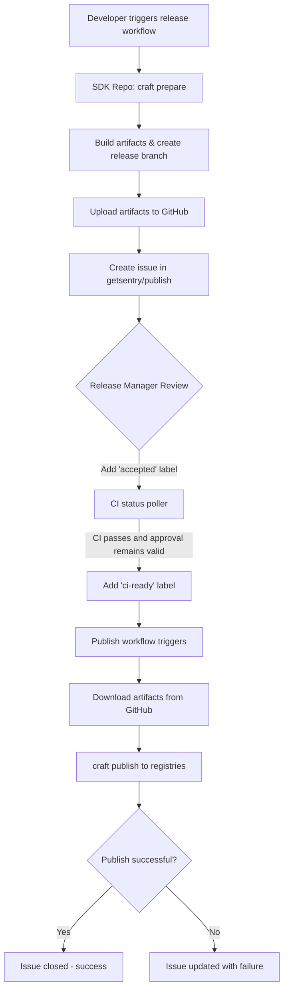

# Sentry Publish 🏠

This is a meta/control repository that implements the [Central Publish Repository](docs/rfc.md) RFC

## Quick Start

[craft quick start](https://craft.sentry.dev/github-actions/)

## Release Flow


```mermaid
flowchart TD
    A[Developer triggers release workflow] --> B["SDK Repo: craft prepare"]
    B --> C[Build artifacts & create release branch]
    C --> D[Upload artifacts to GitHub]
    D --> E["Create issue in getsentry/publish"]
    E --> F{Release Manager Review}
    F -->|"Add 'accepted' label"| G[CI status poller]
    G -->|"CI passes and approval remains valid"| H["Add 'ci-ready' label"]
    H --> I[Publish workflow triggers]
    I --> J[Download artifacts from GitHub]
    J --> K["craft publish to registries"]
    K --> L{Publish successful?}
    L -->|Yes| M[Issue closed - success]
    L -->|No| N[Issue updated with failure]
```

## Goals

1.  We do not want employees to publish through their own accounts
1.  We do not want employees to have access to the global credentials
1.  We do not want employees to build and publish releases from their machines
1.  We want releases to require formal approvals from a limited set of release managers
1.  We want all the above to not discourage from any engineer initiating a release

## Usage

1. Go to your repo and trigger the workflow (example: https://github.com/getsentry/sentry/actions/manual?workflow=.github%2Fworkflows%2Frelease.yml)
1. Once the workflow finishes, see the publishing request in this repo (example: #40)
1. Add the [**`accepted`**](https://github.com/getsentry/publish/labels/accepted) label to start approval and CI checks. Since this action requires elevated permissions, you may need to ask your team lead or manager
1. Observe the issue for the `ci-ready` transition and the publish run
1. The issue will automatically be closed when publishing succeeds

## Publish Issue Format

The release workflow creates publish requests with a stable title and body contract. See
[Publish Issue Format](docs/publish-issue-format.md) for the accepted syntax and fields.

## CalVer

To enable calendar versioning, add the following to your `.craft.yml`:

```yaml
versioning:
  policy: calver
  calver:
    format: "%y.%-m" # e.g., 24.12 for December 2024
    offset: 14 # Days to look back for date calculation (optional)
```

See the [Craft CalVer documentation](https://craft.sentry.dev/configuration/#calendar-versioning-calver) for more details.

## Merge Target

By default, all releases will be merged to the default branch of your repository (usually `master` or `main`). If you want to override this, pass the `merge_target` input in your release workflow. For example, using [Craft's reusable workflow](https://craft.sentry.dev/github-actions/#option-1-reusable-workflow-recommended). Pin the reusable workflow to an immutable commit and pass only the secrets it declares; never use a mutable tag or `secrets: inherit`:

```yaml
name: Release
on:
  workflow_dispatch:
    inputs:
      version:
        description: Version to release
        required: false
      merge_target:
        description: Target branch to merge into (optional)
        required: false

jobs:
  release:
    uses: getsentry/craft/.github/workflows/release.yml@c8a878c53d937a62124796b39ac00f4d73212fe0
    with:
      version: ${{ inputs.version }}
      merge_target: ${{ inputs.merge_target }}
```

The same `merge_target` input is also available when using the [Craft composite action](https://craft.sentry.dev/github-actions/#option-2-composite-action) directly.

## Approvals

Packages we release into the wider world that our customers install, require an explicit approval. This for instance applies to
`sentry-cli`, our SDKs or the `symbolicator` distributed utilities. Internal dependencies such as `arroyo` can be published
with an auto approval. The reasoning here is that the bump of the dependency requires an explicit approval again in Sentry
proper. In theory if an independent package gets sufficient independent use of Sentry we might want to reconsider an auto
approval process for such package as it might become an interesting target for an attacker.

Automatic approvals are managed in the [`auto-approve.yml`](https://github.com/getsentry/publish/blob/main/.github/workflows/auto-approve.yml) workflow.

## Under the hood

The system uses [Craft](https://github.com/getsentry/craft) under the hood to prepare and publish releases. It uses tokens from [Sentry Release Bot](https://github.com/apps/sentry-release-bot), which is a GitHub App that is installed on all repos in `getsentry` with read and write access to code, PRs, and actions. We utilize the [create-github-app-token](https://github.com/actions/create-github-app-token) to generate a short live token in every action run, with `SENTRY_RELEASE_BOT_CLIENT_ID` and `SENTRY_RELEASE_BOT_PRIVATE_KEY` defined at the organization level.

This repo is read-only for everyone except release managers. Secret-bearing jobs use the protected `production` environment, which permits only `main` deployments and does not allow administrator bypass. This protects environment-scoped credentials from arbitrary workflow refs. See getsentry/sentry#21930 for an example.

Manual poller recovery uses `.github/workflows/ci-poller-dispatch.yml` as a no-secret `workflow_dispatch` relay. The protected `production` environment accepts only `main`; a successful relay then triggers the default-branch `workflow_run` path in `ci-poller.yml`. Do not add secrets, repository dispatches, or publishing logic to the relay.

The protected `production` environment must also contain `PUBLISH_ATTESTATION_SECRET`, a dedicated shared secret used to sign approval and CI-ready attestations. It must never be reused for publishing credentials.

The final validator consumes that key before starting Craft, then removes it and its validator-only credentials from the parent environment before spawning target-repository publishing code. Craft receives only the publishing credentials explicitly listed by the workflow.

`SENTRY_INTERNAL_APP_PRIVATE_KEY` and `SENTRY_RELEASE_BOT_PRIVATE_KEY` are organization-level secrets. Their availability to other repositories is an organization-wide security concern that this repository cannot narrow; Security must manage that boundary separately.

Due to the same reason above, [Craft's GitHub Actions](https://craft.sentry.dev/github-actions/) (which replace the now-deprecated `action-prepare-release`) also utilize tokens from Sentry Release Bot. This is to automatically create publish request issues from the action. We cannot use `GITHUB_TOKEN` for these actions as [GitHub prevents triggering more workflows via this token](https://docs.github.com/en/actions/reference/events-that-trigger-workflows).
